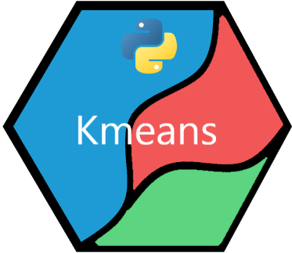

# kmeans_py

[](https://github.com/UBC-MDS/kmeans_py/issues)

## Installation

Install the latest version of this package directly from GitHub:

```
pip install git+https://github.com/UBC-MDS/kmeans_py.git@master
```

## Usage

Simple example demonstrating the functionality of this package:

```
# imports for data generation
import kmeans_py
import numpy as np
from numpy.random import normal
# % matplotlib inline # if your using jupyter notebooks

# generate synthetic data with three clusters
x = np.concatenate([normal(1,1,20), normal(6,3,30), normal(10,2,15)])
y = np.concatenate([normal(15,2,20), normal(2,2,30), normal(8,3,15)])
synth_data = np.array([x,y]).T

# intialize, cluster, and report results
m = kmeans_py.kmeans_py.kmeans(data=synth_data, K=3)
m.initialize_centers()
m.cluster_points()
m.report()
```

## Overview

**kmeans_py** is an Python package aimed towards a user-friendly way of exploring and implementing k-means clustering.

The package integrates and simplifies different functions, such as [sklearn's KMeans](http://scikit-learn.org/stable/modules/generated/sklearn.cluster.KMeans.html) and [scipy's kmeans](https://docs.scipy.org/doc/scipy-0.15.1/reference/generated/scipy.cluster.vq.kmeans.html), into one easy-to-use package.

The package includes the `kmeans` class that has the following methods:

* `initialize_centers(algorithm="kmeans++")` Creating initialization values. By default implements [kmeans++](https://en.wikipedia.org/wiki/K-means%2B%2B) initialization algorithm. Called for its side effects (returns `None`) of updating the `initial_values` of the `kmeans` object.

* `cluster_points(max_iter=100)` Classifies each observation in `data` by performing [k-means clustering](https://en.wikipedia.org/wiki/K-means_clustering). The number of clusters is derived from the number of initial centers determined by the `initialize_centers` methods. Called for its side effects (returns `None`) of updating the `cluster_assignments` and `cluster_centers` of the `kmeans` object.

* `report()` Visualizes clustered data using the object values updated by calling the `cluster_points` method. Prints a cluster summary and plot
the clustered data (if it is teo dimensional).

## Contributors

[Bradley Pick](https://github.com/bradleypick)

[Charley Carriero](https://github.com/charcarr)

[Johannes Harmse](https://github.com/johannesharmse)
